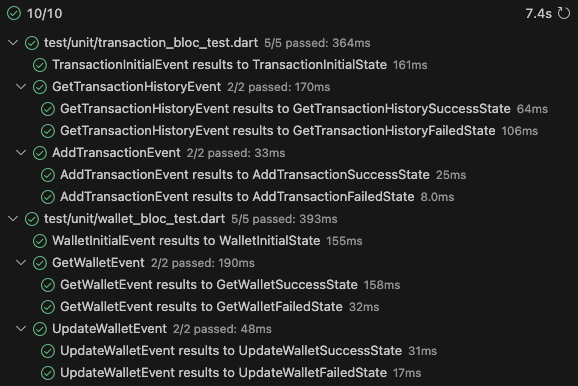

# wally2

A simple wallet app built with Flutter.

## Getting Started

To run the code, use:  
`make rebuild`

To run the tests, use:  
`make tests`

## Additional Resources

[Screen recording of the running application](https://drive.google.com/file/d/14AF0RlLYPkZN6wLF7aNUYVP-XZ01j5HK/view?usp=sharing)
